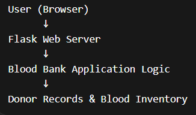
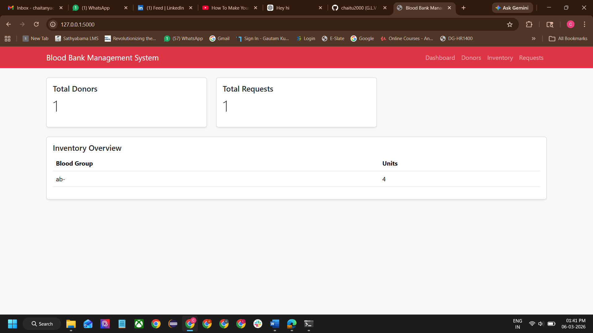

# Blood Bank Management System

A recruiter-friendly Flask project that manages blood donors, blood inventory, and hospital requests.

## Why this project matters
This project shows:
- full-stack application structure
- CRUD operations
- SQLite integration
- practical problem-solving for a real-world workflow

## Tech Stack
- Python
- Flask
- SQLite
- HTML / Jinja templates
- Bootstrap CDN

## Features
- add and view donors
- add and view inventory
- create hospital requests
- simple dashboard counts

## How to run
```bash
pip install -r requirements.txt
python app.py
```

Then open:
```text
http://127.0.0.1:5000
```

## Overview of the Project
- Developed a Flask-based blood bank management application with donor, inventory, and hospital request modules.
- Built SQLite-backed CRUD workflows and dashboard metrics to support inventory visibility and request tracking.
- Structured the project with reusable templates and a clean web app flow for real-world operational use cases.


## Architecture



## Application Screenshots

### Home Page


### Blood Availability Search


## Features

- Blood donor registration
- Blood group management
- Blood availability search
- Simple web interface for managing records

## Technologies Used

- Python
- Flask
- HTML Templates
- Web Application Development